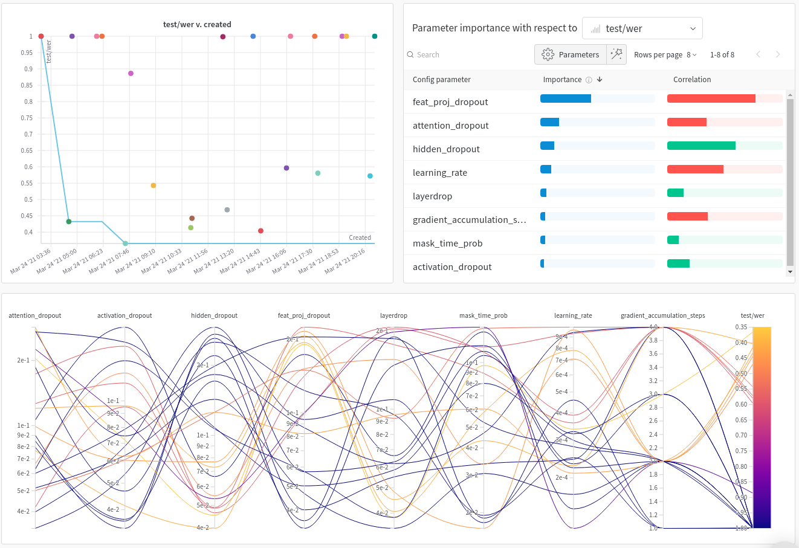

# xlsr-sweeps - Fine-tune wav2vec2 using W&B sweeps

Sweeps ongoing:
* [Random search to understand which hyper-parameters matter](https://wandb.ai/wandb/xlsr/sweeps/p23j88jo?workspace=user-borisd13)

  

## Instructions

* install requirements (requires `master` branch of `transformers)

  `pip install -r requirements.txt`

* make sure you're logged into W&B

  `wandb login`

* define your sweep configuration file (see `sweep.yaml`)

* create a sweep -> this will return a sweep id

  * `wandb sweep sweep.yaml` for an initial random search
  * `wandb sweep sweep_finetuning.yaml` for a bayesian search

* launch an agent against the sweep

  `wandb agent my_sweep_id`
